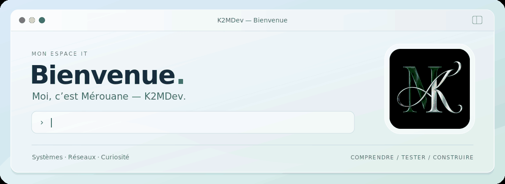

  <picture>
    <source media="(prefers-reduced-motion: reduce)" srcset="./assets/welcome-macos-static.png" />
    
  </picture>

  
  &nbsp;
  

 

  Moi, c’est <strong>Mérouane</strong>. 
  J’aime comprendre les systèmes, explorer les réseaux 
  et mettre les mains dans un labo pour passer de la théorie à la pratique.

  <code>Systèmes</code> &nbsp; <code>Réseaux</code> &nbsp; <code>Cybersécurité</code>

 

### Un peu plus sur mon univers

Ouvre une rubrique pour découvrir mes outils, mes expériences en laboratoire et ce que j’approfondis.

<strong>01 · Mes outils</strong> — systèmes, réseaux et support

 

| Domaine | Outils et technologies que j’ai pratiqués |
| :--- | :--- |
| Systèmes et services | Windows Server · Active Directory · Ubuntu Server · DNS · DHCP |
| Réseaux | Cisco Packet Tracer · TCP/IP · VLAN · pfSense |
| Support et gestion de parc | GLPI · AnyDesk · TeamViewer |

Côté programmation : **bases en Python**, **notions de SQL** et **PowerShell en apprentissage**.

 

<strong>02 · Dans mon lab</strong> — comprendre en expérimentant

 

- **Windows Server** — monter un domaine, gérer des utilisateurs et intégrer des postes.
- **GLPI sous Ubuntu Server** — installer un outil de gestion de parc et le relier à Active Directory avec LDAP.
- **Cisco Packet Tracer** — construire des maquettes, configurer l’adressage et tester les communications.

Des environnements d’apprentissage et de test pour comprendre comment les services fonctionnent ensemble.

 

<strong>03 · Ce que j’approfondis</strong> — les prochaines pistes

 

- **Cybersécurité** — mieux comprendre la protection des systèmes et des réseaux.
- **Automatisation** — progresser en scripting pour simplifier les tâches répétitives.
- **Infrastructures** — approfondir les liens entre les machines virtuelles, les services et les sauvegardes.

J’avance en expérimentant, en vérifiant les résultats et en reprenant ce qui reste à comprendre.

 

---

  Une question ou un sujet IT à partager ? <a href="mailto:merouane.karki@gmail.com">Échangeons.</a> 
  K2MDev · Apprendre en pratiquant.

